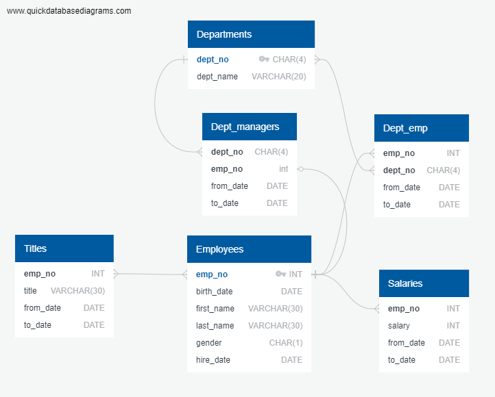

# SQL Challenge


UT-TOR-DATA-PT-01-2020-U-C Week 10 Assignment


(c) Boris Smirnov


## Project files


### Data Modeling


Modeling was done using [QuickDBD](http://www.quickdatabasediagrams.com)

Files:

* Diagram.png
* Diagram.txt
* Diagram.pdf





```
# SQL Homework
# UT-TOR-DATA-PT-01-2020-U-C Assignment #9
# (c) Boris Smirnov

Departments as d
----------------
dept_no CHAR(4) PK
dept_name VARCHAR(20)

Employees as e
--------------
emp_no INT PK
birth_date DATE
first_name VARCHAR(30)
last_name VARCHAR(30)
gender CHAR(1)
hire_date DATE

Dept_managers as dm
-------------------
# every department had several managers (one at a time)
# each manager managed only one department
dept_no CHAR(4) FK >- d.dept_no
# every manager is an employee
# employee may be a amnager or may be not
emp_no int FK 0- e.emp_no
from_date DATE
to_date DATE

Dept_emp as de
--------------
# every department employee is company employee
# there are employees who worked for more then one department
emp_no INT PK FK >- e.emp_no
# every departmnet has many employees
# there are employees who worked in more then one department
dept_no CHAR(4) FK >-< d.dept_no
from_date DATE PK
to_date DATE

Titles as t
-----------
# an employee may have many titles (one at a time)
# every title have many employees
emp_no INT FK >-< e.emp_no
title VARCHAR(30)
from_date DATE
to_date DATE

Salaries as s
-------------
# every salary was paid to one employee
# every employee was paid salary one or more times
emp_no INT FK >- e.emp_no
salary INT
from_date DATE
to_date DATE
```


## Data Engineering


Using [QuickDBD](http://www.quickdatabasediagrams.com) the DB schema was exported and then edited:

* removed quotes around table names
* added some indexes


The result is in **Create_tables.sql** file


```sql
-- Exported from QuickDBD: https://www.quickdatabasediagrams.com/
-- Link to schema: https://app.quickdatabasediagrams.com/#/d/5e2XSw
-- NOTE! If you have used non-SQL datatypes in your design, you will have to change these here.

-- SQL Homework
-- UT-TOR-DATA-PT-01-2020-U-C Assignment
-- (c) Boris Smirnov

CREATE TABLE Departments (
    dept_no CHAR(4)   NOT NULL   PRIMARY KEY,
    dept_name VARCHAR(20)   NOT NULL
);


CREATE TABLE Employees (
    emp_no INT   NOT NULL   PRIMARY KEY,
    birth_date DATE   NOT NULL,
    first_name VARCHAR(30)   NOT NULL,
    last_name VARCHAR(30)   NOT NULL,
    gender CHAR(1)   NOT NULL,
    hire_date DATE   NOT NULL
);

CREATE INDEX idx_Employees_last_name 
ON Employees(last_name);

CREATE INDEX idx_Employees_first_name 
ON Employees(first_name);

CREATE INDEX idx_Employees_hire_date 
ON Employees(hire_date);


CREATE TABLE Dept_managers (
    dept_no CHAR(4)   NOT NULL,
    emp_no int   NOT NULL,
    from_date DATE   NOT NULL,
    to_date DATE   NOT NULL,
    -- Relationship: Dept_managers.dept_no Many-One Departments.dept_no
	-- every department had several managers (one at a time)
    -- each manager managed only one department
    FOREIGN KEY(dept_no) REFERENCES Departments(dept_no),
    -- Relationship: Dept_managers.emp_no ZeroOrOne-One Employees.emp_no
    -- every manager is an employee
    -- employee may be a manager or may be not
    FOREIGN KEY(emp_no) REFERENCES Employees(emp_no)
);

CREATE INDEX idx_Dept_managers_emp_no
ON Dept_emp(emp_no);

CREATE INDEX idx_Dept_managers_dept_no
ON Dept_emp(dept_no);


CREATE TABLE Dept_emp (
    emp_no INT   NOT NULL,
    dept_no CHAR(4)   NOT NULL,
    from_date DATE   NOT NULL,
    to_date DATE   NOT NULL,
	-- Hypothesis:
	--  * An employee works in one department only at any particular moment
	--  * It is possible for an employee to change departments
	--  * Start date of employment at a department along with employee id uniquely identify every row in the table
	-- PRIMARY KEY(emp_no, from_date),
	-- Hypothesis failed: Employee 21076 started working in Production and Development on the same day. Import failed.
	--
    -- Relationship: Dept_emp.emp_no Many-One Employees.emp_no
	-- every department employee is company employee
    -- there are employees who worked for more then one department
    FOREIGN KEY(emp_no) REFERENCES Employees(emp_no),
    -- Relationship: Dept_emp.dept_no Many-Many Departments.dept_no
    -- every departmnet has many employees
    -- there are employees who worked in more then one department
    FOREIGN KEY(dept_no) REFERENCES Departments(dept_no)
);

CREATE INDEX idx_Dept_emp_emp_no
ON Dept_emp(emp_no);

CREATE INDEX idx_Dept_emp_dept_no
ON Dept_emp(dept_no);


CREATE TABLE Titles (
    emp_no INT   NOT NULL,
    title VARCHAR(30)   NOT NULL,
    from_date DATE   NOT NULL,
    to_date DATE   NOT NULL,
	-- Hypothesis:
	--  * An employee has one title only at any particular moment
	--  * It is possible for an employee to change title
	--  * Start date of obtaining a title along with employee id uniquely identify every row in the table
	PRIMARY KEY(emp_no, from_date),
	-- Hypothesis proved to be true - data import succeeded
	--
    -- Relationship: Titles.emp_no Many-Many Employees.emp_no
	-- an employee may have many titles (one at a time)
    -- every title have many employees
    FOREIGN KEY(emp_no) REFERENCES Employees(emp_no)
);


CREATE TABLE Salaries (
    emp_no INT   NOT NULL,
    salary INT   NOT NULL,
    from_date DATE   NOT NULL,
    to_date DATE   NOT NULL,
    -- Relationship: Salaries.emp_no Many-One Employees.emp_no
    -- every salary was paid to one employee
    -- every employee was paid salary one or more times
	-- In fact, this table is One-One relationship
    FOREIGN KEY(emp_no) REFERENCES Employees(emp_no)
);
```


## Data Analysis


SQL queries are in **Queries.sql**


```sql
-- SQL Homework
-- UT-TOR-DATA-PT-01-2020-U-C Assignment
-- (c) Boris Smirnov


-- 1. List the following details of each employee: employee number, last name, first name, gender, and salary.
-- It appears, Salaries table contains only one year salary for each employee
-- In the ER-diagram I specified the relationship between the two tables as One-to-Many:
--		One employee was paid 1 or more salaries, each salary was paid to one employee.
-- In reality the relationship is One-to-One.
select
	e.emp_no as "Employee Number",
	e.last_name as "Last Name",
	e.first_name as "First Name", 
	e.gender as "Gender",
	s.salary as "Salary"
from Employees as e
left join Salaries as s on s.emp_no = e.emp_no;


-- 2. List employees who were hired in 1986.
select
	e.emp_no as "Employee Number",
	e.last_name as "Last Name",
	e.first_name as "First Name",
	e.hire_date as "Date Hired"
from Employees as e
where extract(year from e.hire_date) = 1986;


-- 3.List the manager of each department with the following information:
--   department number, department name, the manager's employee number, last name, first name,
--   and start and end employment dates.
select
	d.dept_no as "Department Number",
	d.dept_name as "Department Name",
	e.emp_no as "Manager''s Employee Number",
	e.last_name as "Manager''s Last Name",
	e.first_name as "Manager''s First Name",
	dm.from_date as "Start of employment", 
	dm.to_date as "End of employment"
from Dept_managers as dm
left join Employees as e on dm.emp_no = e.emp_no
left join Departments as d on dm.dept_no = d.dept_no;


-- 4. List the department of each employee with the following information:
--    employee number, last name, first name, and department name.
-- The problems:
--  a. employees can change departments -> I'll choose only the last department where an employee worked
--  b. there is at least on employee (id:21076, I think there were 29 of them) who started to work in two different
--     departments at the same time but finished at different dates. For such cases I'll choose the last department
--     such an employee worked in (and hope those end times deffer for each department, which is in fact the case)
--  c. by the date this database was last actualized some employees had left the company (and hence a department
--     where they worked), others were still employed. The later employees have their 'to_date' field set to '9999-01-01'
--     but the former have actual date when they left the job (59900 of them).
-- The tactics:
--  a. Use group by on emp_no in the Dept_emp table to find last date an employee left a department - innermost select
--  b. Use these unique combinations of emp_no and that last date as criterion for finding dept_no - middle level select
--  c. Combine emp_no and dept_no with tables Employees and Departments to get names information - top level select
select
	e.emp_no as "Employee Number",
	e.last_name as "Last Name",
	e.first_name as "First Name",
	d.dept_name as "Department Name"
from (
	select
		Dept_emp.emp_no,
		Dept_emp.dept_no
	from (
		select emp_no, MAX(to_date) as max_date
		from Dept_emp
		group by emp_no
	) as Last_emp
	left join Dept_emp on (Last_emp.emp_no = Dept_emp.emp_no) and (Last_emp.max_date = Dept_emp.to_date)
) as dm
left join Employees as e on dm.emp_no = e.emp_no
left join Departments as d on dm.dept_no = d.dept_no;


-- 5. List all employees whose first name is "Hercules" and last names begin with "B."
select
	e.emp_no as "Employee Number",
	e.first_name as "First Name",
	e.last_name as "Last Name"
from Employees as e
where (e.first_name = 'Hercules') and (e.last_name like 'B%');


-- 6. List all employees in the Sales department, including their employee number, last name, first name, and department name.
select
	e.emp_no as "Employee Number",
	e.last_name as "Last Name",
	e.first_name as "First Name",
	d.dept_name as "Department Name"
from Dept_emp as de
left join Employees as e on de.emp_no = e.emp_no
left join Departments as d on de.dept_no = d.dept_no
where
	de.to_date = '9999-01-01' -- current employees
	and de.dept_no in (
		select dept_no
		from Departments
		where dept_name = 'Sales'
	);

-- 7. List all employees in the Sales and Development departments, including their employee number,
-- last name, first name, and department name.
select
	e.emp_no as "Employee Number",
	e.last_name as "Last Name",
	e.first_name as "First Name",
	d.dept_name as "Department Name"
from Dept_emp as de
left join Employees as e on de.emp_no = e.emp_no
left join Departments as d on de.dept_no = d.dept_no
where
	de.to_date = '9999-01-01' -- current employees
	and de.dept_no in (
		select dept_no
		from Departments
		where dept_name in ('Sales', 'Development')
	);


-- 8. In descending order, list the frequency count of employee last names, i.e., how many employees share each last name.
select
	last_name as "Last Name",
	count(emp_no) as "Frequency"
from Employees
group by last_name
order by "Frequency" desc;
```


## Bonus


Bonus part was implemented in **Bonus.ipynb**. It requires **dbconfig.py** that should have _user_ and _password_ variables
for connecting to local PostgreSQL server.


## Epilogue


Epilogue part was done in **Employee499942.sql**


```sql
select
	e.first_name,
	e.last_name,
	e.gender,
	e.birth_date,
	e.hire_date,
	de.from_date as "Department start date",
	d.dept_name,
	t.from_date as "Title start date",
	t.title,
	s.salary
 from Employees as e
left join Dept_emp as de on e.emp_no = de.emp_no
left join Departments as d on de.dept_no = d.dept_no
left join Titles as t on e.emp_no = t.emp_no
left join Salaries as s on e.emp_no = s.emp_no
where e.emp_no = 499942
```
